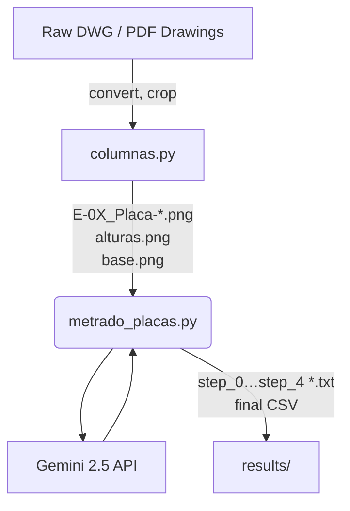

# Automated Slab (Placa) Quantity Take‑Off Pipeline (`metrado_placas.py`)

`metrado_placas.py` is a **multi‑stage, multimodal workflow** that extracts,
cross‑checks and consolidates every datum required for an accurate
**quantity take‑off (metrado) of reinforced‑concrete slabs** in multi‑storey
buildings.  
It consumes the pre‑cropped images generated by **`columnas.py`** (or any
drawing set arranged in the expected folders) and uses
**Google Gemini 2.5 Pro (multimodal)** to interpret structural drawings.

<p align="center">
  
  
</p>

---

## 1&nbsp;&nbsp;Pipeline at a Glance



1. **`columnas.py`**  
   Recursively locates drawings, crops relevant regions and captures ranges
   from `metrado_base.xlsx`, saving all assets under `output/`.

2. **`metrado_placas.py`**  
   Executes a **five‑step Gemini pipeline**:
   1. *Technical specifications* — splicing, stirrups and slab notes  
   2. *Slab geometry* — width, length, thickness, reinforcement schedule  
   3. *Associations* — which slab belongs to which section/cut  
   4. *Heights & bar lengths* per floor, including overlap logic  
   5. *Final summary table* in plain CSV (C‑rows & E‑rows)

---

## 2&nbsp;&nbsp;Key Features

| Feature | Description |
|---------|-------------|
| 🔍 Robust asset discovery | Works with arbitrarily nested folder structures |
| 🖼️ 3×3 tiling | Splits drawings into 9 crops to improve OCR accuracy |
| 🗂️ Incremental prompt context | Keeps Gemini requests stateless yet coherent |
| 📑 Audit‑ready artefacts | Saves every prompt & response to `results/` |
| ⚙️ Highly configurable | Change folder names, coordinates or prompt text with minimal edits |

---

## 3&nbsp;&nbsp;Requirements

| Dependency | Purpose |
|------------|---------|
| Python 3.8 + | Runtime |
| `google‑generativeai` | Gemini 2.5 API |
| `python‑dotenv` | Load `GOOGLE_API_KEY` securely |
| `Pillow` | Image loading & manipulation |
| `opencv‑python` | (Pre‑processing) cropping utilities |
| `pandas` | Data wrangling (future use) |
| `pyautogui` / `pywin32` | Excel screenshot in `columnas.py` |
| `pdf2image` *(opt.)* | High‑quality PDF ➜ PNG |

Install all dependencies:

```bash
pip install google-generativeai python-dotenv Pillow opencv-python pandas pyautogui pywin32 pdf2image
```

> **Windows + Microsoft Excel** are required only if you run `columnas.py`.

---

## 4&nbsp;&nbsp;Environment Variables

Create a file called **`GOOGLE_API_KEY.env`** in the project root:

```
GOOGLE_API_KEY=YOUR_GEMINI_KEY
```

---

## 5&nbsp;&nbsp;Installation

```bash
git clone https://github.com/your_org/your_repo.git
cd your_repo
pip install -r requirements.txt   # optional convenience
```

---

## 6&nbsp;&nbsp;Quick Start

```bash
# 1 – Ensure the drawings are under <PROJECT>/output/
#     (generated by columnas.py or manually exported).

python metrado_placas.py        --planos_dir output        --output_dir results
```

The script will automatically:

1. Load all images from the expected folders  
2. Tile each image (3×3) to maximise text extraction  
3. Run the 5‑stage Gemini workflow  
4. Save every prompt and response under `results/`

---

### Customising Folder Names / Crops

Edit `metrado_placas.py`:

- **Folder lists** in `carpetas_objetivo_*` arrays  
- **Cropping grid** in `dividir_en_cuadros()` (default 3×3)

---

## 7&nbsp;&nbsp;Output Structure

```
results/
├── step_0_prompt.txt
├── step_0_response.txt
├── step_1_prompt.txt
├── step_1_response.txt
├── ...
├── step_4_response.txt   # FINAL CSV table
```

Every stage is **idempotent** and can be re‑run independently.

---

## 8&nbsp;&nbsp;Technical Notes

* Model ID defaults to `gemini-2.5-pro-preview-06-05`
  (override in `AgenteGeminiMultimodal`).  
* Prompts are written in **English** to maximise Gemini performance.  
* Heights & bar lengths follow the overlap / splicing rules extracted in *Step 0*.  
* For slabs without explicit data, the script flags the omission for manual review.

---

## 9&nbsp;&nbsp;Contributing

1. Fork the repository  
2. `git checkout -b feat/my-feature`  
3. Commit (`git commit -m "feat: add cool feature"`)  
4. Push (`git push origin feat/my-feature`)  
5. Open a Pull Request

Please follow **[Conventional Commits](https://www.conventionalcommits.org/)**.

---

## 10&nbsp;&nbsp;License

Released under the **MIT License**. See [`LICENSE`](LICENSE).

---

> *Crafted to accelerate slab metrado and minimise manual errors.*
